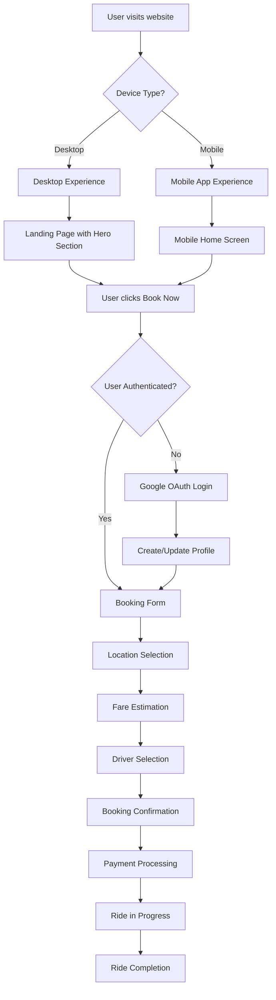
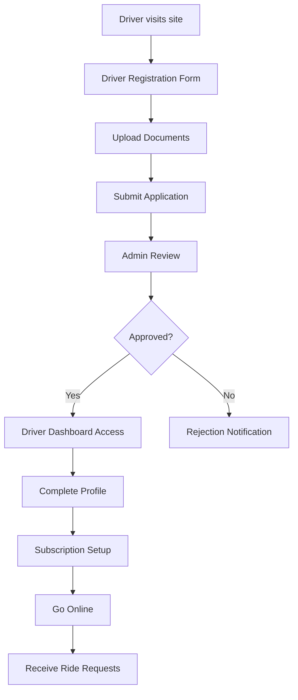
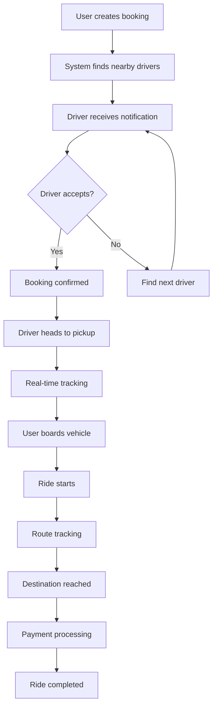
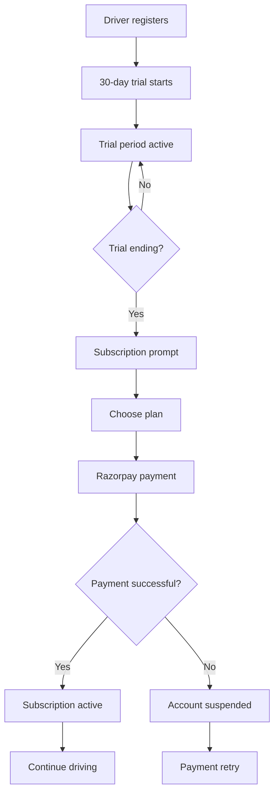
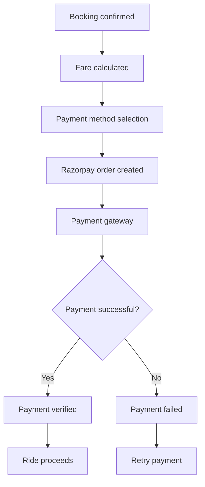
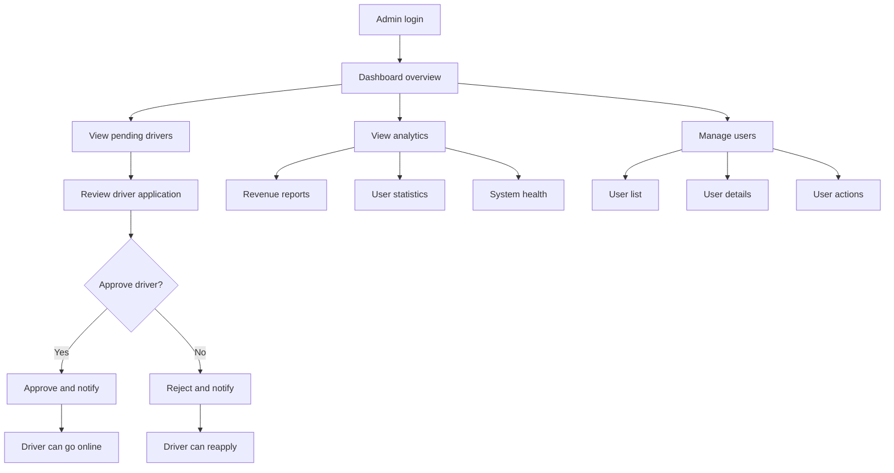

# 🚗 Goa Taxi App - Complete Project Flow Documentation

## 📋 Table of Contents
1. [Project Overview](#project-overview)
2. [System Architecture](#system-architecture)
3. [User Roles & Permissions](#user-roles--permissions)
4. [Complete User Flow](#complete-user-flow)
5. [Technical Implementation](#technical-implementation)
6. [Database Schema](#database-schema)
7. [API Endpoints](#api-endpoints)
8. [Real-time Features](#real-time-features)
9. [Payment Flow](#payment-flow)
10. [Mobile App Flow](#mobile-app-flow)
11. [Admin Dashboard Flow](#admin-dashboard-flow)
12. [Security & Authentication](#security--authentication)
13. [Deployment & Production](#deployment--production)

---

## 🎯 Project Overview

**Goa Taxi App** is a comprehensive taxi booking platform built with Next.js 14, featuring:
- **Multi-platform experience**: Responsive web + mobile app-like interface
- **Three user roles**: Users (passengers), Drivers, and Admins
- **Real-time features**: Live tracking, instant notifications, chat system
- **Payment integration**: Razorpay for subscriptions and payments
- **Location services**: Google Maps integration with geocoding
- **PWA capabilities**: Installable web app with offline functionality

### 🏗️ Tech Stack
- **Frontend**: Next.js 14, React 18, TypeScript, Tailwind CSS
- **Backend**: Next.js API Routes, Supabase (PostgreSQL + PostGIS)
- **Authentication**: Supabase Auth with Google OAuth
- **Payments**: Razorpay integration
- **Maps**: Google Maps API with Places Autocomplete
- **Real-time**: WebSocket connections via Supabase
- **Deployment**: Vercel with edge functions

---

## 🏛️ System Architecture

```
┌─────────────────┐    ┌─────────────────┐    ┌─────────────────┐
│   Web Browser   │    │  Mobile Device  │    │   PWA App       │
│   (Desktop)     │    │   (Responsive)   │    │   (Installable) │
└─────────┬───────┘    └─────────┬───────┘    └─────────┬───────┘
          │                      │                      │
          └──────────────────────┼──────────────────────┘
                                 │
                    ┌─────────────▼─────────────┐
                    │     Next.js Frontend      │
                    │   (App Router + Pages)    │
                    └─────────────┬─────────────┘
                                 │
                    ┌─────────────▼─────────────┐
                    │    Next.js API Routes     │
                    │   (Serverless Functions)  │
                    └─────────────┬─────────────┘
                                 │
          ┌──────────────────────┼──────────────────────┐
          │                      │                      │
┌─────────▼─────────┐  ┌─────────▼─────────┐  ┌─────────▼─────────┐
│   Supabase Auth   │  │  Supabase Database│  │   Razorpay API    │
│   (OAuth + JWT)   │  │  (PostgreSQL)     │  │   (Payments)      │
└───────────────────┘  └───────────────────┘  └───────────────────┘
          │                      │                      │
          └──────────────────────┼──────────────────────┘
                                 │
                    ┌─────────────▼─────────────┐
                    │    Google Maps API        │
                    │   (Geocoding + Places)    │
                    └───────────────────────────┘
```

---

## 👥 User Roles & Permissions

### 1. **User (Passenger)**
- **Permissions**: Book rides, view booking history, manage profile
- **Access**: Public booking form, user dashboard, mobile user panel
- **Features**: Location selection, fare estimation, driver selection, payment

### 2. **Driver**
- **Permissions**: Accept/reject rides, update location, manage earnings
- **Access**: Driver dashboard, mobile driver panel, subscription management
- **Features**: Online/offline toggle, ride history, earnings tracking

### 3. **Admin**
- **Permissions**: Manage users, approve drivers, view analytics, system settings
- **Access**: Admin dashboard, user management, driver approval workflow
- **Features**: Real-time analytics, revenue tracking, system monitoring

---

## 🔄 Complete User Flow

### **Phase 1: User Registration & Authentication**



### **Phase 2: Driver Registration & Approval**



### **Phase 3: Booking & Ride Flow**



---

## ⚙️ Technical Implementation

### **Frontend Architecture**

```
app/
├── layout.tsx                 # Root layout with providers
├── page.tsx                   # Landing page (desktop + mobile)
├── dashboard/                 # User dashboard
├── driver/                    # Driver dashboard
├── admin/                     # Admin dashboard
├── auth/                      # Authentication pages
└── api/                       # API routes

components/
├── MobileApp.tsx             # Mobile app wrapper
├── screens/                   # Mobile screen components
├── forms/                     # Form components
├── ui/                        # Reusable UI components
├── realtime/                  # Real-time components
├── payments/                  # Payment components
└── providers/                 # Context providers
```

### **State Management**

```typescript
// Global state with Zustand
interface AppState {
  user: User | null;
  driver: Driver | null;
  bookings: Booking[];
  notifications: Notification[];
  realtime: {
    isConnected: boolean;
    location: LatLng | null;
  };
}

// React Query for server state
const { data: bookings } = useBookings();
const { data: drivers } = useDrivers();
const { data: analytics } = useAnalytics();
```

---

## 🗄️ Database Schema

### **Core Tables**

```sql
-- User profiles (extends Supabase auth)
profiles (
  id, email, full_name, phone, role, is_verified
)

-- Driver information
drivers (
  id, user_id, license_number, vehicle_type, 
  car_name, car_number, status, is_online,
  current_location, rating, total_earnings
)

-- Booking records
bookings (
  id, user_id, driver_id, vehicle_type,
  pickup_location, drop_location, pickup_date,
  estimated_fare, final_fare, status
)

-- Subscription management
subscriptions (
  id, driver_id, razorpay_subscription_id,
  plan_name, amount, status, start_date, end_date
)

-- Payment history
payments (
  id, user_id, booking_id, amount, 
  razorpay_payment_id, status, created_at
)
```

### **Real-time Features**

```sql
-- Real-time location updates
CREATE TABLE driver_locations (
  driver_id UUID PRIMARY KEY,
  location GEOGRAPHY(POINT),
  updated_at TIMESTAMP DEFAULT NOW()
);

-- Real-time notifications
CREATE TABLE notifications (
  id UUID PRIMARY KEY,
  user_id UUID,
  title TEXT,
  message TEXT,
  type TEXT,
  is_read BOOLEAN DEFAULT FALSE,
  created_at TIMESTAMP DEFAULT NOW()
);
```

---

## 🔌 API Endpoints

### **Authentication & Users**
```
POST   /api/auth/login          # Google OAuth login
POST   /api/auth/reset-password # Password reset
GET    /api/users               # Get all users (admin)
GET    /api/users/[id]          # Get user profile
PUT    /api/users/[id]          # Update user profile
DELETE /api/users/[id]          # Delete user (admin)
```

### **Driver Management**
```
POST   /api/drivers/register    # Driver registration
GET    /api/drivers             # Get all drivers
GET    /api/drivers/nearby      # Find nearby drivers
GET    /api/drivers/[id]        # Get driver profile
PUT    /api/drivers/[id]/approve    # Approve driver
PUT    /api/drivers/[id]/reject     # Reject driver
PUT    /api/drivers/[id]/location   # Update location
```

### **Booking System**
```
GET    /api/bookings            # Get user bookings
POST   /api/bookings            # Create booking
GET    /api/bookings/[id]       # Get specific booking
PUT    /api/bookings/[id]/assign-driver  # Assign driver
PUT    /api/bookings/[id]/complete       # Complete booking
DELETE /api/bookings/[id]       # Cancel booking
```

### **Payments & Subscriptions**
```
GET    /api/subscriptions       # Get user subscriptions
POST   /api/razorpay/create-order    # Create payment order
POST   /api/razorpay/verify-payment  # Verify payment
GET    /api/payments            # Get payment history
```

### **Analytics & Admin**
```
GET    /api/analytics/dashboard # Dashboard stats
GET    /api/analytics/revenue   # Revenue analytics
GET    /api/analytics/rides     # Ride analytics
GET    /api/analytics/drivers   # Driver analytics
```

---

## 🔄 Real-time Features

### **WebSocket Connections**

```typescript
// Real-time subscription setup
const subscription = supabase
  .channel('public:bookings')
  .on('postgres_changes', 
    { event: '*', schema: 'public', table: 'bookings' },
    (payload) => {
      // Handle booking updates
      updateBookingStatus(payload.new);
    }
  )
  .subscribe();
```

### **Live Location Tracking**

```typescript
// Driver location updates
const updateDriverLocation = async (location: LatLng) => {
  await supabase
    .from('driver_locations')
    .upsert({
      driver_id: driverId,
      location: `POINT(${location.lng} ${location.lat})`,
      updated_at: new Date().toISOString()
    });
};
```

### **Push Notifications**

```typescript
// Notification system
const sendNotification = async (userId: string, notification: NotificationData) => {
  await supabase
    .from('notifications')
    .insert({
      user_id: userId,
      title: notification.title,
      message: notification.message,
      type: notification.type
    });
};
```

---

## 💳 Payment Flow

### **Driver Subscription Flow**



### **Booking Payment Flow**



---

## 📱 Mobile App Flow

### **Mobile Experience Structure**

```
MobileApp.tsx
├── MobileHomeScreen.tsx       # Landing with booking form
├── MobileBookingScreen.tsx    # Full booking experience
├── MobileUserPanel.tsx        # User dashboard
├── MobileDriverPanel.tsx      # Driver dashboard
└── MobileAdminPanel.tsx       # Admin dashboard
```

### **Navigation Flow**

```typescript
// Mobile navigation states
type AppSection = 
  | 'home'           // Landing page
  | 'booking'        // Booking form
  | 'profile'        // Role selection
  | 'user-panel'     // User dashboard
  | 'driver-panel'   // Driver dashboard
  | 'admin-panel'    // Admin dashboard
  | 'menu';          // App menu
```

### **Mobile Features**

- **Swipe gestures**: Navigate between screens
- **Bottom navigation**: Quick access to main sections
- **App-like interface**: Native mobile experience
- **PWA installation**: Install as mobile app
- **Offline support**: Service worker caching
- **Push notifications**: Real-time updates

---

## 👨‍💼 Admin Dashboard Flow

### **Admin Workflow**



### **Admin Features**

- **Driver approval workflow**: Review and approve/reject drivers
- **User management**: View and manage all users
- **Analytics dashboard**: Real-time statistics and reports
- **System monitoring**: Platform health and performance
- **Revenue tracking**: Payment and subscription analytics
- **Settings management**: Platform configuration

---

## 🔐 Security & Authentication

### **Authentication Flow**

```typescript
// Google OAuth with Supabase
const signInWithGoogle = async () => {
  const { data, error } = await supabase.auth.signInWithOAuth({
    provider: 'google',
    options: {
      redirectTo: `${window.location.origin}/auth/callback`
    }
  });
};
```

### **Role-based Access Control**

```typescript
// Protected route components
<AuthenticatedRoute>     // Requires authentication
<DriverRoute>           // Requires driver role
<AdminRoute>            // Requires admin role
```

### **Security Measures**

- **Row Level Security (RLS)**: Database-level access control
- **JWT tokens**: Secure authentication
- **Input validation**: Zod schema validation
- **Rate limiting**: API request throttling
- **CORS policies**: Cross-origin request control
- **HTTPS enforcement**: Secure communication

---

## 🚀 Deployment & Production

### **Vercel Deployment**

```bash
# Build and deploy
npm run build
vercel --prod

# Environment variables
NEXT_PUBLIC_SUPABASE_URL=your_supabase_url
NEXT_PUBLIC_SUPABASE_ANON_KEY=your_anon_key
GOOGLE_MAPS_API_KEY=your_maps_key
RAZORPAY_KEY_ID=your_razorpay_key
RAZORPAY_KEY_SECRET=your_razorpay_secret
```

### **Production Optimizations**

- **Image optimization**: Next.js Image component
- **Code splitting**: Dynamic imports
- **Caching strategies**: Static generation + ISR
- **Performance monitoring**: Vercel Analytics
- **Error tracking**: Error boundaries + logging
- **SEO optimization**: Meta tags + structured data

### **Monitoring & Analytics**

```typescript
// Performance monitoring
export function reportWebVitals(metric: NextWebVitalsMetric) {
  if (metric.label === 'web-vital') {
    console.log(metric);
    // Send to analytics service
  }
}
```

---

## 📊 Performance Metrics

### **Target Performance**

- **First Contentful Paint**: < 1.5s
- **Largest Contentful Paint**: < 2.5s
- **Cumulative Layout Shift**: < 0.1
- **First Input Delay**: < 100ms
- **Time to Interactive**: < 3.5s

### **Real-time Performance**

- **WebSocket latency**: < 100ms
- **Location update frequency**: Every 5 seconds
- **Payment processing time**: < 10 seconds
- **Booking confirmation**: < 2 seconds

---

## 🔧 Development Workflow

### **Local Development**

```bash
# Install dependencies
npm install

# Start development server
npm run dev

# Run tests
npm run test

# Type checking
npm run type-check

# Linting
npm run lint
```

### **Code Quality**

- **TypeScript**: Strict type checking
- **ESLint**: Code linting and formatting
- **Prettier**: Code formatting
- **Jest**: Unit testing
- **Playwright**: E2E testing

---

## 📈 Future Enhancements

### **Planned Features**

1. **AI-powered fare prediction**: Machine learning for dynamic pricing
2. **Voice commands**: Hands-free booking experience
3. **Multi-language support**: Regional language support
4. **Advanced analytics**: Predictive analytics and insights
5. **Fleet management**: Corporate account management
6. **Integration APIs**: Third-party service integrations

### **Scalability Considerations**

- **Microservices architecture**: Service decomposition
- **CDN integration**: Global content delivery
- **Database sharding**: Horizontal scaling
- **Load balancing**: Traffic distribution
- **Auto-scaling**: Dynamic resource allocation

---

## 📞 Support & Documentation

### **User Support**

- **Help center**: Comprehensive FAQ and guides
- **Live chat**: Real-time customer support
- **Email support**: Technical assistance
- **Phone support**: Emergency contact

### **Developer Resources**

- **API documentation**: Complete endpoint reference
- **SDK libraries**: Client libraries for integration
- **Code examples**: Implementation samples
- **Community forum**: Developer discussions

---

**Last Updated**: January 2025  
**Version**: 1.0.0  
**Status**: Production Ready ✅
