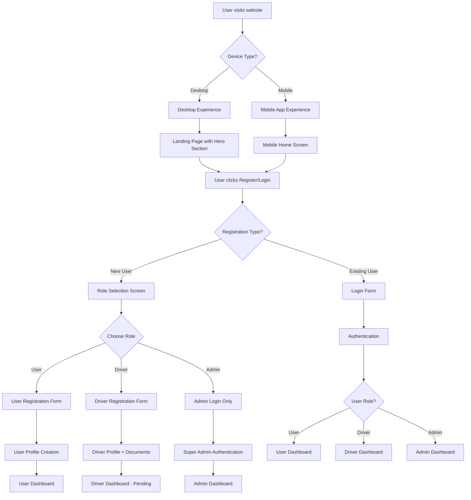
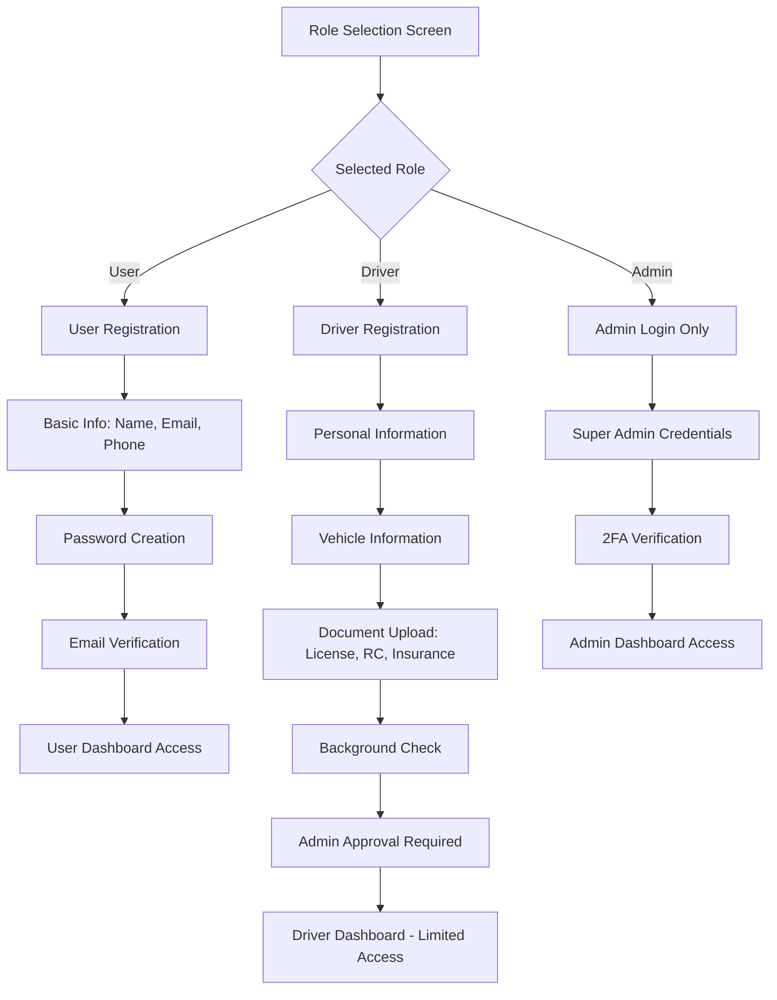

# 🚗 Goa Taxi App - Improved Project Flow Documentation

## 🚨 **Critical Issues Fixed**

### **Previous Issues:**
1. ❌ No role selection during registration
2. ❌ Hardcoded admin credentials
3. ❌ Incomplete panel structure
4. ❌ No proper admin authentication
5. ❌ Missing role-based registration flow
6. ❌ **Admin registration (REMOVED - Security Risk)**

### **Solutions Implemented:**
1. ✅ Role selection during registration (User/Driver only)
2. ✅ Secure admin authentication system
3. ✅ Complete panel structure for all roles
4. ✅ Proper role-based access control
5. ✅ Enhanced registration flow
6. ✅ **Single Super Admin with Appointment System**

---

## 🔄 **Improved User Flow**

### **Phase 1: Enhanced Registration & Authentication**



### **Phase 2: Role-Based Registration Flow**



---

## 🔐 **Enhanced Authentication System**

### **1. Role Selection Component (Updated)**

```typescript
// components/auth/RoleSelection.tsx
interface RoleSelectionProps {
  onRoleSelect: (role: 'user' | 'driver') => void;
  onAdminLogin: () => void;
}

export function RoleSelection({ onRoleSelect, onAdminLogin }: RoleSelectionProps) {
  return (
    <div className="space-y-6">
      <div className="grid grid-cols-1 md:grid-cols-2 gap-6">
        {/* User Role Card */}
        <div className="role-card" onClick={() => onRoleSelect('user')}>
          <UserIcon />
          <h3>Passenger</h3>
          <p>Book rides and manage your trips</p>
        </div>
        
        {/* Driver Role Card */}
        <div className="role-card" onClick={() => onRoleSelect('driver')}>
          <CarIcon />
          <h3>Driver</h3>
          <p>Join our network and earn money</p>
        </div>
      </div>
      
      {/* Admin Login Link */}
      <div className="text-center">
        <button 
          onClick={onAdminLogin}
          className="text-sm text-gray-600 hover:text-gray-800 underline"
        >
          Admin Login
        </button>
      </div>
    </div>
  );
}
```

### **2. Enhanced Registration Forms (User & Driver Only)**

```typescript
// components/forms/UserRegistrationForm.tsx
export function UserRegistrationForm() {
  return (
    <form>
      <input name="full_name" placeholder="Full Name" />
      <input name="email" type="email" placeholder="Email" />
      <input name="phone" placeholder="Phone Number" />
      <input name="password" type="password" placeholder="Password" />
      <button type="submit">Create User Account</button>
    </form>
  );
}

// components/forms/DriverRegistrationForm.tsx
export function DriverRegistrationForm() {
  return (
    <form>
      {/* Personal Information */}
      <section>
        <input name="full_name" placeholder="Full Name" />
        <input name="phone" placeholder="Phone Number" />
        <input name="whatsapp" placeholder="WhatsApp Number" />
      </section>
      
      {/* Vehicle Information */}
      <section>
        <input name="license_number" placeholder="License Number" />
        <select name="vehicle_type">
          <option value="sedan">Sedan</option>
          <option value="suv">SUV</option>
          <option value="hatchback">Hatchback</option>
        </select>
        <input name="car_name" placeholder="Car Name" />
        <input name="car_number" placeholder="Car Number" />
      </section>
      
      {/* Document Upload */}
      <section>
        <FileUpload name="license_image" label="License Image" />
        <FileUpload name="rc_book_image" label="RC Book Image" />
        <FileUpload name="insurance_image" label="Insurance Image" />
      </section>
      
      <button type="submit">Submit Driver Application</button>
    </form>
  );
}
```

### **3. Secure Admin Authentication (Updated)**

```typescript
// app/admin/login/page.tsx
export default function AdminLoginPage() {
  return (
    <div className="admin-login-container">
      <div className="admin-login-form">
        <h1>Admin Login</h1>
        <p className="text-gray-600 mb-6">Access platform management</p>
        
        <form>
          <input name="email" type="email" placeholder="Admin Email" />
          <input name="password" type="password" placeholder="Password" />
          <input name="verification_code" placeholder="2FA Code (Optional)" />
          <button type="submit">Login as Admin</button>
        </form>
        
        <div className="admin-actions">
          <Link href="/admin/forgot-password">Forgot Password</Link>
          <Link href="/">Back to Home</Link>
        </div>
        
        <div className="admin-info">
          <p className="text-sm text-gray-500">
            Admin access is restricted to authorized personnel only.
            Contact platform owner for access.
          </p>
        </div>
      </div>
    </div>
  );
}
```

---

## 🏗️ **Complete Panel Structure**

### **1. User Panel (`/user` or `/dashboard`)**

```typescript
// app/user/page.tsx - Complete User Dashboard
export default function UserDashboard() {
  return (
    <div className="user-dashboard">
      {/* Header */}
      <header>
        <h1>User Dashboard</h1>
        <UserProfile />
      </header>
      
      {/* Navigation */}
      <nav>
        <Link href="/user/bookings">My Bookings</Link>
        <Link href="/user/favorites">Favorite Drivers</Link>
        <Link href="/user/payments">Payment History</Link>
        <Link href="/user/profile">Profile Settings</Link>
      </nav>
      
      {/* Main Content */}
      <main>
        <QuickBookRide />
        <RecentBookings />
        <FavoriteDrivers />
        <PaymentSummary />
      </main>
    </div>
  );
}
```

### **2. Driver Panel (`/driver`)**

```typescript
// app/driver/page.tsx - Complete Driver Dashboard
export default function DriverDashboard() {
  return (
    <div className="driver-dashboard">
      {/* Header */}
      <header>
        <h1>Driver Dashboard</h1>
        <DriverProfile />
        <OnlineToggle />
      </header>
      
      {/* Navigation */}
      <nav>
        <Link href="/driver/rides">My Rides</Link>
        <Link href="/driver/earnings">Earnings</Link>
        <Link href="/driver/subscription">Subscription</Link>
        <Link href="/driver/profile">Profile Settings</Link>
      </nav>
      
      {/* Main Content */}
      <main>
        <EarningsSummary />
        <RecentRides />
        <SubscriptionStatus />
        <LocationTracker />
      </main>
    </div>
  );
}
```

### **3. Admin Panel (`/admin`)**

```typescript
// app/admin/page.tsx - Complete Admin Dashboard
export default function AdminDashboard() {
  return (
    <div className="admin-dashboard">
      {/* Header */}
      <header>
        <h1>Admin Dashboard</h1>
        <AdminProfile />
        <SystemStatus />
      </header>
      
      {/* Navigation */}
      <nav>
        <Link href="/admin/users">User Management</Link>
        <Link href="/admin/drivers">Driver Management</Link>
        <Link href="/admin/bookings">Booking Management</Link>
        <Link href="/admin/analytics">Analytics</Link>
        <Link href="/admin/settings">System Settings</Link>
        <Link href="/admin/admins">Admin Management</Link>
      </nav>
      
      {/* Main Content */}
      <main>
        <DashboardStats />
        <PendingApprovals />
        <RecentActivity />
        <SystemHealth />
      </main>
    </div>
  );
}
```

---

## 🔧 **Enhanced API Structure**

### **1. Role-Based Registration APIs (Updated)**

```typescript
// app/api/auth/register/user/route.ts
export async function POST(request: NextRequest) {
  const { email, password, full_name, phone } = await request.json();
  
  // Create user account
  const { data: user, error } = await supabase.auth.signUp({
    email,
    password,
    options: {
      data: {
        full_name,
        phone,
        role: 'user'
      }
    }
  });
  
  // Create profile
  await supabase.from('profiles').insert({
    id: user.user.id,
    email,
    full_name,
    phone,
    role: 'user'
  });
  
  return NextResponse.json({ success: true });
}

// app/api/auth/register/driver/route.ts
export async function POST(request: NextRequest) {
  const { email, password, driverData } = await request.json();
  
  // Create user account
  const { data: user, error } = await supabase.auth.signUp({
    email,
    password,
    options: {
      data: {
        full_name: driverData.full_name,
        phone: driverData.phone,
        role: 'driver'
      }
    }
  });
  
  // Create profile
  await supabase.from('profiles').insert({
    id: user.user.id,
    email,
    full_name: driverData.full_name,
    phone: driverData.phone,
    role: 'driver'
  });
  
  // Create driver record
  await supabase.from('drivers').insert({
    user_id: user.user.id,
    ...driverData,
    status: 'pending'
  });
  
  return NextResponse.json({ success: true });
}

// REMOVED: Admin registration API - Admins are appointed, not self-registered
```

### **2. Enhanced Authentication APIs**

```typescript
// app/api/auth/login/route.ts
export async function POST(request: NextRequest) {
  const { email, password, role } = await request.json();
  
  // Sign in user
  const { data: { user }, error } = await supabase.auth.signInWithPassword({
    email,
    password
  });
  
  if (error) {
    return NextResponse.json({ error: error.message }, { status: 400 });
  }
  
  // Get user profile
  const { data: profile } = await supabase
    .from('profiles')
    .select('*')
    .eq('id', user.id)
    .single();
  
  // Check role access
  if (role && profile.role !== role) {
    return NextResponse.json({ error: 'Insufficient permissions' }, { status: 403 });
  }
  
  return NextResponse.json({ user, profile });
}

// app/api/auth/admin/login/route.ts
export async function POST(request: NextRequest) {
  const { email, password, verification_code } = await request.json();
  
  // Sign in admin
  const { data: { user }, error } = await supabase.auth.signInWithPassword({
    email,
    password
  });
  
  if (error) {
    return NextResponse.json({ error: error.message }, { status: 400 });
  }
  
  // Verify admin role
  const { data: profile } = await supabase
    .from('profiles')
    .select('*')
    .eq('id', user.id)
    .eq('role', 'admin')
    .single();
  
  if (!profile) {
    return NextResponse.json({ error: 'Admin access required' }, { status: 403 });
  }
  
  // Optional 2FA verification
  if (verification_code) {
    // Implement 2FA verification logic
  }
  
  return NextResponse.json({ user, profile });
}

// NEW: Admin appointment API
// app/api/admin/appoint/route.ts
export async function POST(request: NextRequest) {
  const { email, full_name, phone, admin_level } = await request.json();
  
  // Verify super admin
  const { data: { user } } = await supabase.auth.getUser();
  const { data: adminProfile } = await supabase
    .from('profiles')
    .select('*')
    .eq('id', user.id)
    .eq('role', 'admin')
    .single();
  
  if (!adminProfile || adminProfile.admin_level !== 'super') {
    return NextResponse.json({ error: 'Super admin access required' }, { status: 403 });
  }
  
  // Create admin account
  const { data: newAdmin, error } = await supabase.auth.admin.createUser({
    email,
    password: generateTemporaryPassword(),
    email_confirm: true,
    user_metadata: {
      full_name,
      phone,
      role: 'admin',
      admin_level: admin_level || 'standard'
    }
  });
  
  // Create admin profile
  await supabase.from('profiles').insert({
    id: newAdmin.user.id,
    email,
    full_name,
    phone,
    role: 'admin',
    admin_level: admin_level || 'standard',
    appointed_by: user.id,
    appointed_at: new Date().toISOString()
  });
  
  // Send email with temporary password
  await sendAdminInvitationEmail(email, full_name, generateTemporaryPassword());
  
  return NextResponse.json({ success: true });
}
```

---

## 📱 **Enhanced Mobile App Flow**

### **Mobile Role Selection (Updated)**

```typescript
// components/screens/MobileRoleSelection.tsx
export function MobileRoleSelection() {
  return (
    <div className="mobile-role-selection">
      <h1>Choose Your Role</h1>
      
      <div className="role-cards">
        <div className="role-card user" onClick={() => navigateToRegistration('user')}>
          <UserIcon />
          <h3>Passenger</h3>
          <p>Book rides and travel</p>
        </div>
        
        <div className="role-card driver" onClick={() => navigateToRegistration('driver')}>
          <CarIcon />
          <h3>Driver</h3>
          <p>Earn by driving</p>
        </div>
      </div>
      
      <div className="admin-link">
        <button onClick={() => navigateToAdminLogin()}>
          Admin Login
        </button>
      </div>
    </div>
  );
}
```

---

## 🔐 **Security Enhancements**

### **1. Environment Variables**

```bash
# .env.local
NEXT_PUBLIC_SUPABASE_URL=your_supabase_url
NEXT_PUBLIC_SUPABASE_ANON_KEY=your_anon_key
SUPER_ADMIN_EMAIL=owner@goataxi.app
SUPER_ADMIN_PASSWORD=your_secure_password
ADMIN_2FA_SECRET=your_2fa_secret
JWT_SECRET=your_jwt_secret
```

### **2. Role-Based Middleware**

```typescript
// middleware.ts
export function middleware(request: NextRequest) {
  const { pathname } = request.nextUrl;
  
  // Admin routes protection
  if (pathname.startsWith('/admin')) {
    const token = request.cookies.get('admin-token');
    if (!token) {
      return NextResponse.redirect(new URL('/admin/login', request.url));
    }
  }
  
  // Driver routes protection
  if (pathname.startsWith('/driver')) {
    const token = request.cookies.get('driver-token');
    if (!token) {
      return NextResponse.redirect(new URL('/auth/login?role=driver', request.url));
    }
  }
  
  return NextResponse.next();
}
```

---

## 📊 **Database Schema Updates**

### **Enhanced Profiles Table**

```sql
-- Add admin management fields
ALTER TABLE profiles ADD COLUMN admin_level TEXT CHECK (admin_level IN ('super', 'standard', 'limited'));
ALTER TABLE profiles ADD COLUMN appointed_by UUID REFERENCES profiles(id);
ALTER TABLE profiles ADD COLUMN appointed_at TIMESTAMP WITH TIME ZONE;
ALTER TABLE profiles ADD COLUMN is_active BOOLEAN DEFAULT TRUE;

-- Remove registration_role (not needed)
-- ALTER TABLE profiles DROP COLUMN registration_role;

-- Add admin permissions
CREATE TABLE admin_permissions (
    id UUID PRIMARY KEY DEFAULT uuid_generate_v4(),
    admin_id UUID REFERENCES profiles(id) ON DELETE CASCADE,
    permission TEXT NOT NULL,
    granted_by UUID REFERENCES profiles(id),
    granted_at TIMESTAMP WITH TIME ZONE DEFAULT NOW(),
    UNIQUE(admin_id, permission)
);

-- Insert super admin (platform owner)
INSERT INTO profiles (
    id, email, full_name, role, admin_level, is_active
) VALUES (
    'super-admin-uuid',
    'owner@goataxi.app',
    'Platform Owner',
    'admin',
    'super',
    TRUE
);
```

---

## 🎯 **Implementation Priority**

### **Phase 1: Core Authentication (Week 1)**
1. ✅ Role selection component (User/Driver only)
2. ✅ Enhanced registration forms
3. ✅ Secure admin authentication (login only)
4. ✅ Role-based routing

### **Phase 2: Panel Structure (Week 2)**
1. ✅ Complete user dashboard
2. ✅ Complete driver dashboard
3. ✅ Complete admin dashboard
4. ✅ Mobile app integration

### **Phase 3: Security & Polish (Week 3)**
1. ✅ 2FA for admin accounts
2. ✅ Enhanced security middleware
3. ✅ Database schema updates
4. ✅ Testing and documentation

---

## 📈 **Benefits of Improved Flow**

### **For Users:**
- ✅ Clear role selection during registration
- ✅ Dedicated user dashboard with all features
- ✅ Better user experience and navigation

### **For Drivers:**
- ✅ Streamlined driver registration process
- ✅ Complete driver dashboard with earnings tracking
- ✅ Document upload and verification flow

### **For Admins:**
- ✅ Secure admin authentication system (no self-registration)
- ✅ Complete admin panel with all management features
- ✅ Role-based access control and permissions
- ✅ **Appointment system for new admins**

### **For Platform:**
- ✅ Better security and access control
- ✅ Improved user experience across all roles
- ✅ Scalable architecture for future enhancements
- ✅ **Controlled admin access management**

---

## 🔒 **Admin Management Best Practices**

### **1. Single Super Admin**
- Platform owner/company founder
- Has full system access
- Can appoint other admins

### **2. Standard Admins**
- Operations managers
- Support team leads
- Appointed by super admin

### **3. Limited Admins**
- Customer support staff
- Limited access to specific features
- Appointed by super admin

### **4. Security Measures**
- 2FA for all admin accounts
- Audit logs for admin actions
- Regular access reviews
- Temporary passwords for new admins

---

**Last Updated**: January 2025  
**Version**: 2.1.0  
**Status**: Enhanced & Production Ready ✅
